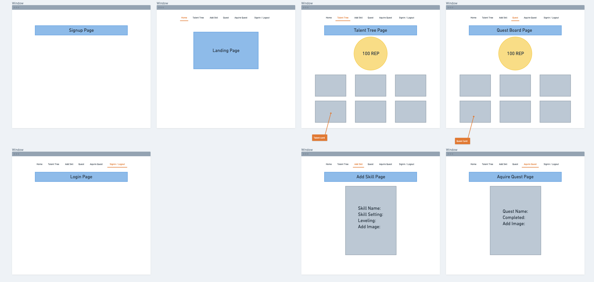
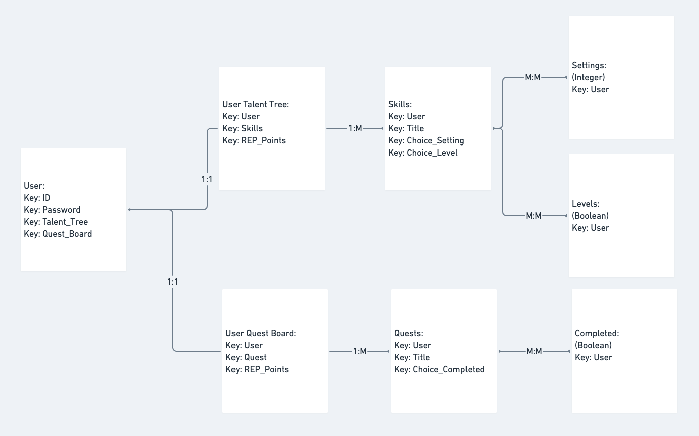
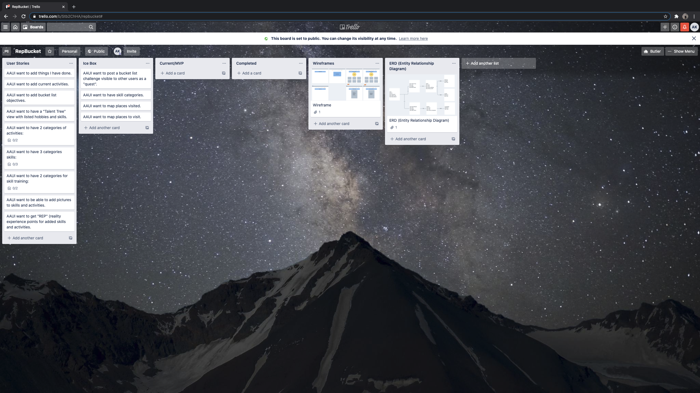

# RepBucket

## Description:

Repbucket is a platform that "gamifies" the tracking and highlighting of achievements, activities, skills, hobbies, and goals. From the mundane to monumental, goals are your "Quests", which can be found on your "Quest Board". Your skills and hobbies are represented as skills on your "Talent Tree". Level them up as you see fit.

## Deployment Link: 

## User Stories:
- AAUI want to add things I have done.
- AAUI want to add current activities.
- AAUI want to  add bucket list objectives.
- AAUI want to have a "Talent Tree" view with listed hobbies and skills.
- AAUI want to have 2 categories of activities:
  - Quest in progress (Intend on completing).
  - Quest Completed.
- AAUI want to have 3 categories skills:
  - Easy Mode (Novice).
  - Medium Mode (Intermediate).
  - Hard Mode (Expert / Advanced).
- AAUI want to have 2 categories for skill training:
  - Default (not currently active).
  - Leveling (active with skill).
- AAUI want to be able to add pictures to skills and activities.
- AAUI want to get "REP" (reality experience points for added skills and activities.

## Wireframes / ERD (Entity Relationship Diagram):

## Trello Board:
## https://trello.com/b/Stb2ChHA/repbucket#

## Screenshots:

## Technology Used:
- HTML
- CSS
- Python
- Django Framework
- PostgreSQL Database
- Bootstrap CSS
- github.com
- Kite
- VS Code Editor

## Stretch Goals:
- AAUI want to post a bucket list challenge visible to other users as a "quest".
- AAUI want to have skill categories.
- AAUI want to map places visited.
- AAUI want to map places to visit.

## Resources and References: 
// https://getbootstrap.com/
// https://docs.djangoproject.com/en/3.0/topics/forms/
// https://thenounproject.com/term/bucket-list/2119421/
// https://thenounproject.com/term/bucket-list/3212168/
// https://www.tutorialrepublic.com/faq/how-to-align-responsive-image-in-center-in-bootstrap.php
// https://stackoverflow.com/questions/11555931/make-footer-stick-to-bottom-of-page-using-twitter-bootstrap